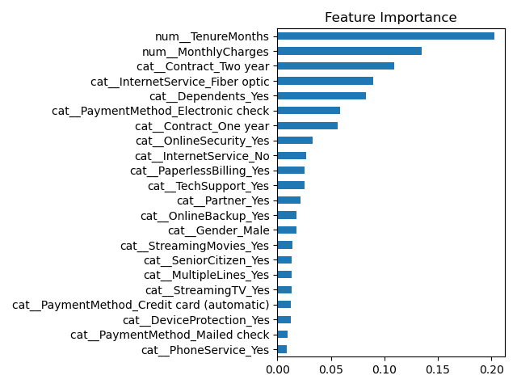
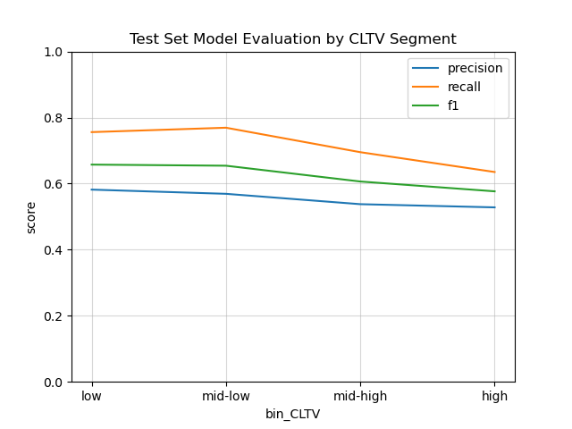

# Telco Customer Churn

## Introduction

For a telecommunication company, customers churn when they end their contracts and switch provider. Reasons for churn include, among others, better offers from competitors or disappointment with the service.

Keeping existing customers is often cheaper than acquiring new ones. If a company can predict if a customer is likely to churn, they can try to retain them.

In this report, we analyse the Telco customer churn dataset to identify the features that are most strongly correlated with churn.

We then train a classification model to estimates each customer's probability of churning. To measure how reliable the model is, we answer two questions:

- Of those customers who are predicted to churn, how many actually did churn?
- Of those customers who actually churned, how many are correctly predicted to churn?

Finally, we combine churn probability with customer lifetime value to suggest different retention strategies depending on customer business value.

# Body

## Data

The Telco dataset has 7043 entries. It contains information about demographics, location (not used), services (phone, internet, etc.), and status (whether or not the customer churned).

73% of the customers in the dataset didn’t churn. If we were to naively predict “Not churn” for every customer, the model would have an accuracy score of 73% (percentage of correct predictions).

Therefore, accuracy is not a reliable evaluation metric.

## Analysis

We analyse the features that are highly correlated with churn.

- Customers with higher current monthly charges are more likely to churn.
- Customers with shorter tenure (the total number or months the customer has been with the company) are more likely to churn.
- Customers who live without dependents (children, parents, grandparents) are more likely to churn.
- Customers who subscribe to fiber-optic internet are more likely to churn than those with DSL or no internet service.
- Customers on month-to-month contracts are more likely to churn than those on one- or two-year contracts.
- Customers who pay using electronic check are more likely to churn than those who use bank transfer, credit card, or mailed check.

When customers leave the company, they are asked about their reasons for leaving.

Reasons include:

- Competitor offered higher downloads speeds, more data, or a better overall deal.
- Dissatisfaction with network reliability or general product or service dissatisfaction.
- The attitude of the support person representative or service provider.
- The price was too high.

| Churn Category  | Percentage |
|-----------------|------------|
| Competitor      | 33.2%      |
| Dissatisfaction | 24.9%      |
| Attitude        | 17.5%      |
| Price           | 13.0%      |
| Other           | 11.4%      |

## Methods

To predict churn, we train a Random Forest classifier.

For each customer, the model returns a probability score (between 0 and 1). If the threshold is 0.5, customers with a probability score ≥ 0.5 are labelled as churners, and customers with a score < 0.5 are labelled as non-churners.

Because 73% of the customers in the dataset didn’t churn, during training, we assign more weight to those customers who did churn.

We evaluate the model using cross-validation. The main evaluation metrics are precision, recall, f1 score, and AUC.

||RandomForestClassifier_balanced|
|-----------|-------|
| accuracy  | 0.783 |
| precision | 0.570 |
| recall	| 0.747 |
| f1	    | 0.647 |
| roc_auc	| 0.857 |

Precision: Of those who are predicted to churn, how many actually did churn?

> If precision is low, you’re flagging lots of customers as churners who aren’t actually going to leave. Every false positive corresponds to unnecessary retention effort.
> 

Recall: Of those who actually churned, how many are correctly predicted to churn?

> High recall means you catch most of the customers who would leave. If recall is low, your model is letting churners slip through unnoticed.
> 

Precision and recall depend on the choice of threshold.

If we increase the threshold, we flag fewer customers: precision increases and recall decreases.

f1 score is the harmonic mean between precision and recall.

> F1 score is a single measure that balances correctly identifying churners and avoiding false alarms.
> 

AUC represents the probability that the model, if given a randomly chosen positive (churner) and negative (non-churner) example, will assign a higher score to the churner.

## Results

We analyse the relative influence of each customer attribute by listing importance scores for all model features, linking them back to the patterns identified earlier in the analysis.

Finally, we evaluate results across customer value groups, splitting customers by predicted lifetime value (it’s in the dataset). This confirms that churn signals remain accurate across all segments.

## Recommendations

By combining predicted churn probability with customer lifetime value, we propose differentiated retention strategies:

- High-value + high-risk → personalised outreach, targeted offers, proactive support.
- Low-value + high-risk → automated cost-efficient interventions.

Churn reason data also signals key operational priorities—especially customer service improvements due to poor staff attitude.

# Conclusions

The analysis highlights clear and consistent patterns in customer churn. Customers are much more likely to leave when they have no dependents, use fibre-optic internet, are on month-to-month contracts, have shorter tenures, or pay higher monthly charges.

To support proactive retention, we trained a predictive model using a Random Forest approach. The model performs well at identifying real leavers among those flagged, while also capturing a high share of customers who truly left, giving the company a reliable tool to estimate churn risk.

Because not all customers bring the same long-term value, we designed retention strategies focused on higher-value customers, based on their estimated lifetime revenue. This ensures that intervention efforts can be prioritised where they deliver the greatest financial return.

In addition, about 20% of customers who left reported doing so due to a negative service experience, particularly poor staff attitude. This signals that improving customer service quality should be treated as a core retention priority, alongside targeted offers and contract strategies.